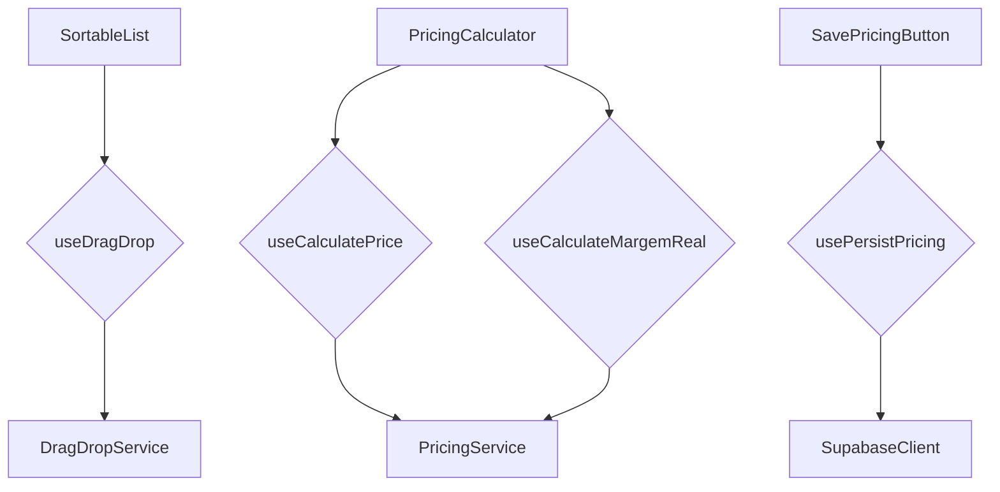

# Drag & Drop, Cálculo e Persistência — Design e Contratos

## 1. Mapeamento de Responsabilidades

### Drag & Drop
- **Componentes**: `SortableList`, `DraggableItem`
- **Hooks**: `useDragDrop`
- **Responsabilidades**:
  - Renderizar lista ordenável com suporte a drag-and-drop.
  - Manter estado local da ordem e informar mudanças via `onOrderChange`.
  - Delegar persistência para camada superior.

### Cálculo
- **Componentes**: `PricingCalculator`
- **Hooks**: `useCalculatePrice`, `useCalculateMargemReal`
- **Responsabilidades**:
  - Orquestrar chamadas ao serviço de cálculo.
  - Validar entradas do usuário e tratar erros.
  - Expor resultado tipado aos componentes pais.

### Persistência
- **Componentes**: `SavePricingButton`
- **Hook**: `usePersistPricing`
- **Responsabilidades**:
  - Persistir dados de precificação no Supabase.
  - Gerir estados de carregamento e erro.
  - Garantir idempotência em salvamentos repetidos.

## 2. Diagrama de Componentes e Hooks



## 3. Contratos de Props e Retorno

```ts
// Drag & Drop
export interface SortableListProps<T> {
  items: T[];
  onOrderChange: (items: T[]) => void;
}

export interface UseDragDropReturn {
  sensors: SensorDescriptor<any>[];
  activeId: string | null;
  handleDragStart(event: DragStartEvent): void;
  handleDragOver(event: DragOverEvent): void;
  handleDragEnd(event: DragEndEvent): void;
}

// Cálculo
export interface PricingCalculatorProps {
  productId: string;
  marketplaceId: string;
  onResult(result: PricingResult): void;
}

export interface UseCalculatePriceReturn {
  calculate(input: CalculatePriceInput): Promise<PricingResult>;
  isLoading: boolean;
}

// Persistência
export interface UsePersistPricingReturn {
  save(data: PricingPersistInput): Promise<void>;
  isSaving: boolean;
}
```

Os tipos auxiliares `PricingResult`, `CalculatePriceInput` e `PricingPersistInput` serão definidos conforme a modelagem de dados existente.
