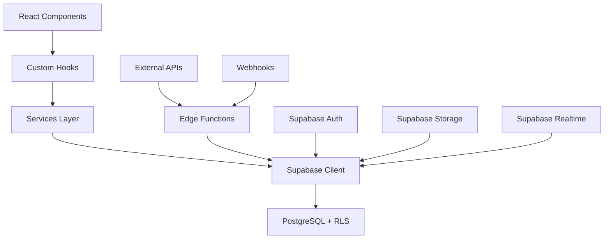

# Arquitetura Lovable - Decisões e Padrões

## 🏗️ Visão Geral da Arquitetura

### Stack Completo
```
Frontend: React 18 + TypeScript + Vite
Backend: Supabase Edge Functions (Deno)
Database: PostgreSQL + Row Level Security
Auth: Supabase Auth (OAuth + Email)
Storage: Supabase Storage
Real-time: Supabase Realtime
Styling: Tailwind CSS + shadcn/ui
State: React Query + React Context
```

### Fluxo de Dados


## 🔧 Decisões Arquiteturais

### 1. Frontend: React SPA vs SSR
**Decisão**: React SPA com Vite
**Razão**: Lovable não suporta SSR; Edge Functions fornecem backend
**Implicações**: 
- SEO via meta tags dinâmicas
- Loading states essenciais
- Client-side routing

### 2. Backend: Edge Functions vs Traditional Server
**Decisão**: Supabase Edge Functions exclusivamente
**Razão**: Serverless, escalável, integrado ao Supabase
**Implicações**:
- Deno runtime (não Node.js)
- Stateless functions
- Cold start considerations

### 3. Database: PostgreSQL + RLS vs NoSQL
**Decisão**: PostgreSQL com Row Level Security
**Razão**: Relacional, ACID, segurança nativa
**Implicações**:
- Policies obrigatórias
- Joins eficientes
- Transações ACID

### 4. Authentication: Custom vs Supabase Auth
**Decisão**: Supabase Auth
**Razão**: OAuth integrado, seguro, escalável
**Implicações**:
- JWT automático
- Providers externos
- RLS integration

### 5. State Management: Redux vs React Query
**Decisão**: React Query + Context
**Razão**: Server state separado, cache inteligente
**Implicações**:
- Cache automático
- Background refetch
- Optimistic updates

## 📊 Padrões de Implementação

### Services Layer
```typescript
// Camada de abstração para Supabase
export class BaseService {
  protected static handleError(error: any) {
    console.error('Service Error:', error);
    throw new Error(error.message || 'Erro inesperado');
  }
}

export class ProductsService extends BaseService {
  static async getAll() {
    const { data, error } = await supabase
      .from('products')
      .select('*, categories(name)')
      .order('created_at', { ascending: false });
    
    if (error) this.handleError(error);
    return data;
  }
}
```

### Custom Hooks Pattern
```typescript
// Hook para gerenciar estado do servidor
export function useProducts() {
  return useQuery({
    queryKey: ['products'],
    queryFn: ProductsService.getAll,
    staleTime: 5 * 60 * 1000, // 5 minutos
    cacheTime: 10 * 60 * 1000, // 10 minutos
  });
}

// Hook para mutations
export function useCreateProduct() {
  const queryClient = useQueryClient();
  
  return useMutation({
    mutationFn: ProductsService.create,
    onSuccess: () => {
      queryClient.invalidateQueries(['products']);
      toast.success('Produto criado com sucesso!');
    },
    onError: (error) => {
      toast.error(`Erro: ${error.message}`);
    },
  });
}
```

### Edge Functions Structure
```typescript
// Estrutura padrão para Edge Functions
import { serve } from "https://deno.land/std@0.168.0/http/server.ts";
import { createClient } from 'https://esm.sh/@supabase/supabase-js@2';
import { corsHeaders } from '../_shared/cors.ts';

interface RequestBody {
  // Define interface
}

interface ResponseBody {
  // Define interface
}

serve(async (req: Request): Promise<Response> => {
  // 1. Handle CORS
  if (req.method === 'OPTIONS') {
    return new Response('ok', { headers: corsHeaders });
  }

  try {
    // 2. Initialize Supabase
    const supabase = createClient(
      Deno.env.get('SUPABASE_URL')!,
      Deno.env.get('SUPABASE_SERVICE_ROLE_KEY')!
    );

    // 3. Validate request
    const body: RequestBody = await req.json();
    
    // 4. Business logic
    const result = await processBusinessLogic(body);

    // 5. Return success
    return new Response(JSON.stringify(result), {
      headers: { ...corsHeaders, 'Content-Type': 'application/json' },
      status: 200,
    });

  } catch (error) {
    // 6. Handle errors
    console.error('Edge Function Error:', error);
    return new Response(
      JSON.stringify({ error: error.message }),
      {
        headers: { ...corsHeaders, 'Content-Type': 'application/json' },
        status: 400,
      }
    );
  }
});
```

## 🔐 Segurança por Design

### Row Level Security (RLS)
```sql
-- Todas as tabelas devem ter RLS
ALTER TABLE public.products ENABLE ROW LEVEL SECURITY;

-- Policies específicas por operação
CREATE POLICY "Users can view own products" 
ON public.products 
FOR SELECT 
USING (auth.uid() = user_id);

CREATE POLICY "Users can create own products" 
ON public.products 
FOR INSERT 
WITH CHECK (auth.uid() = user_id);
```

### Secrets Management
```typescript
// Edge Functions - secrets via Deno.env
const apiKey = Deno.env.get('EXTERNAL_API_KEY');

// Frontend - apenas variáveis públicas
const supabaseUrl = import.meta.env.VITE_SUPABASE_URL;
```

### Input Validation
```typescript
// Usando Zod para validação
import { z } from 'zod';

const ProductSchema = z.object({
  name: z.string().min(1, 'Nome obrigatório'),
  price: z.number().positive('Preço deve ser positivo'),
  category_id: z.string().uuid('ID de categoria inválido'),
});

// Validar no Edge Function
const validatedData = ProductSchema.parse(requestBody);
```

## 📈 Performance e Escalabilidade

### Database Optimization
```sql
-- Índices estratégicos
CREATE INDEX idx_products_user_id ON products(user_id);
CREATE INDEX idx_products_category ON products(category_id);
CREATE INDEX idx_products_created_at ON products(created_at DESC);

-- Triggers para timestamps
CREATE OR REPLACE FUNCTION update_updated_at_column()
RETURNS TRIGGER AS $$
BEGIN
    NEW.updated_at = now();
    RETURN NEW;
END;
$$ LANGUAGE plpgsql;
```

### Frontend Optimization
```typescript
// Lazy loading de componentes
const ProductModal = lazy(() => import('./ProductModal'));

// React Query com cache inteligente
const useProductsWithCache = () => {
  return useQuery({
    queryKey: ['products'],
    queryFn: ProductsService.getAll,
    staleTime: 5 * 60 * 1000,
    cacheTime: 10 * 60 * 1000,
    refetchOnWindowFocus: false,
  });
};

// Virtualization para listas grandes
import { FixedSizeList } from 'react-window';
```

## 🔄 Real-time Features
```typescript
// Supabase Realtime para updates automáticos
useEffect(() => {
  const subscription = supabase
    .channel('products_changes')
    .on('postgres_changes', {
      event: '*',
      schema: 'public',
      table: 'products',
      filter: `user_id=eq.${user.id}`
    }, (payload) => {
      queryClient.invalidateQueries(['products']);
    })
    .subscribe();

  return () => {
    subscription.unsubscribe();
  };
}, [user.id]);
```

## 🚀 Deploy e CI/CD

### Estrutura de Deploy
```yaml
# .github/workflows/deploy.yml
- name: Deploy Edge Functions
  run: supabase functions deploy --project-ref $PROJECT_REF

- name: Run Database Migrations  
  run: supabase db push --project-ref $PROJECT_REF

- name: Deploy Frontend
  run: npm run build && npm run deploy
```

### Environment Variables
```bash
# Produção
VITE_SUPABASE_URL=https://your-project.supabase.co
VITE_SUPABASE_ANON_KEY=your-anon-key

# Development
VITE_SUPABASE_URL=http://localhost:54321
VITE_SUPABASE_ANON_KEY=local-anon-key
```

## 🎯 Métricas e Monitoramento

### Performance Metrics
- First Contentful Paint < 1.5s
- Time to Interactive < 3s
- Core Web Vitals compliance
- Edge Function cold start < 200ms

### Error Monitoring
```typescript
// Error boundary global
class ErrorBoundary extends Component {
  componentDidCatch(error: Error, errorInfo: ErrorInfo) {
    // Log para Supabase Analytics
    console.error('Global Error:', error, errorInfo);
  }
}
```

## 📋 Checklist de Conformidade

### ✅ Arquitetura
- [ ] Frontend React + TypeScript + Vite
- [ ] Backend Edge Functions apenas
- [ ] Database PostgreSQL + RLS
- [ ] Auth Supabase integrado

### ✅ Código
- [ ] Services layer implementado
- [ ] Custom hooks com React Query
- [ ] Components com shadcn/ui
- [ ] TypeScript strict mode

### ✅ Segurança
- [ ] RLS em todas as tabelas
- [ ] Secrets no Supabase Vault
- [ ] Input validation com Zod
- [ ] CORS configurado

### ✅ Performance
- [ ] Lazy loading implementado
- [ ] Cache strategies definidas
- [ ] Índices database otimizados
- [ ] Bundle size otimizado

Esta arquitetura garante que o projeto seja escalável, seguro e mantenha a conformidade com as especificações do Lovable.