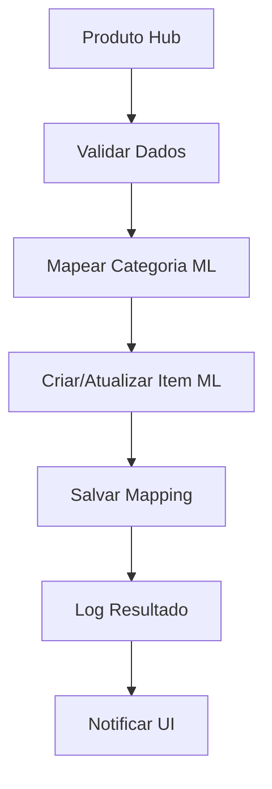

# 📚 Mercado Livre API - Documentação Técnica

## 🎯 Edge Functions Implementadas

### 🔐 **ml-auth** - Autenticação OAuth
**Status**: ✅ **Implementado e Funcional**

#### **Endpoints Disponíveis**

##### `POST /functions/v1/ml-auth`
Gerencia autenticação OAuth com Mercado Livre

**Ações Suportadas:**

```typescript
// 1. Iniciar Autenticação
{
  "action": "start",
  "tenantId": "uuid"
}
// Response: { "authUrl": "https://auth.mercadolibre.com.br/..." }

// 2. Processar Callback
{
  "action": "callback", 
  "code": "TG-xxxxx",
  "tenantId": "uuid"
}
// Response: { "success": true, "user": { ... } }

// 3. Refresh Token
{
  "action": "refresh",
  "tenantId": "uuid" 
}
// Response: { "success": true, "expiresAt": "..." }

// 4. Status da Conexão
{
  "action": "status",
  "tenantId": "uuid"
}
// Response: { "connected": true, "expiresAt": "...", "user": { ... } }
```

**Exemplo de Uso:**
```typescript
// services/ml-auth.ts
export class MLAuthService {
  static async startAuth(tenantId: string) {
    const response = await supabase.functions.invoke('ml-auth', {
      body: { action: 'start', tenantId }
    });
    return response.data;
  }
  
  static async getStatus(tenantId: string) {
    const response = await supabase.functions.invoke('ml-auth', {
      body: { action: 'status', tenantId }
    });
    return response.data;
  }
}
```

---

### 📦 **ml-sync** - Sincronização de Produtos  
**Status**: ✅ **Base Implementada** | **Lógica de Negócio**: 🔄 Em Desenvolvimento

#### **Endpoints Disponíveis**

##### `POST /functions/v1/ml-sync`
Sincroniza produtos entre Hub e Mercado Livre

**Ações Suportadas:**

```typescript
// 1. Sincronizar Produto Individual
{
  "action": "sync-product",
  "productId": "uuid",
  "tenantId": "uuid"
}

// 2. Sincronização em Lote  
{
  "action": "sync-batch",
  "productIds": ["uuid1", "uuid2"],
  "tenantId": "uuid"
}

// 3. Status de Sincronização
{
  "action": "sync-status", 
  "productId": "uuid",
  "tenantId": "uuid"
}

// 4. Buscar Produtos ML
{
  "action": "list-ml-items",
  "tenantId": "uuid",
  "limit": 50
}
```

**Fluxo de Sincronização:**


---

### 📈 **ml-webhook** - Processamento de Vendas
**Status**: ✅ **Implementado** | **Processamento**: 🔄 Em Desenvolvimento

#### **Webhook Handler**

##### `POST /functions/v1/ml-webhook`
Processa notificações do Mercado Livre (não requer autenticação)

**Tópicos Suportados:**
- `orders_v2` - Novos pedidos e mudanças de status
- `items` - Mudanças em anúncios  
- `payments` - Atualizações de pagamento
- `questions` - Perguntas sobre produtos

**Payload Exemplo:**
```json
{
  "resource": "/orders/123456789",
  "user_id": 987654321,
  "topic": "orders_v2", 
  "application_id": 123456,
  "attempts": 1,
  "sent": "2025-01-20T15:30:00Z"
}
```

**Processamento:**
```typescript
// Fluxo interno do webhook
export async function processWebhook(payload: WebhookPayload) {
  // 1. Validar assinatura
  // 2. Identificar tenant
  // 3. Buscar dados completos na API ML
  // 4. Processar conforme tópico
  // 5. Atualizar dados locais
  // 6. Log resultado
}
```

## 🛠️ Integração Frontend

### **Hooks Recomendados**

```typescript
// hooks/useMLAuth.ts
export function useMLAuth() {
  const { data: profile } = useProfile();
  
  return useQuery({
    queryKey: ['ml-auth', profile?.tenant_id],
    queryFn: () => MLAuthService.getStatus(profile.tenant_id),
    enabled: !!profile?.tenant_id,
    refetchInterval: 5 * 60 * 1000 // 5 minutos
  });
}

// hooks/useMLSync.ts  
export function useMLSync() {
  const queryClient = useQueryClient();
  
  return useMutation({
    mutationFn: MLSyncService.syncProduct,
    onSuccess: () => {
      queryClient.invalidateQueries(['products']);
      queryClient.invalidateQueries(['ml-products']);
      toast.success('Produto sincronizado com ML!');
    },
    onError: (error) => {
      toast.error(`Erro na sincronização: ${error.message}`);
    }
  });
}
```

### **Componentes UI**

```typescript
// components/ml/MLConnectionCard.tsx
export function MLConnectionCard() {
  const { data: auth, isLoading } = useMLAuth();
  const startAuth = useMLAuthStart();
  
  if (isLoading) return <MLConnectionSkeleton />;
  
  return (
    <Card>
      <CardHeader>
        <CardTitle>Mercado Livre</CardTitle>
        <MLConnectionBadge status={auth?.connected} />
      </CardHeader>
      
      <CardContent>
        {auth?.connected ? (
          <MLConnectedInfo user={auth.user} />
        ) : (
          <Button onClick={() => startAuth.mutate()}>
            Conectar com Mercado Livre
          </Button>
        )}
      </CardContent>
    </Card>
  );
}
```

## 🔍 Debugging e Logs

### **Visualizar Logs das Edge Functions**

1. **ML Auth Logs**: Problemas de OAuth
2. **ML Sync Logs**: Erros de sincronização  
3. **ML Webhook Logs**: Falhas no processamento

### **Queries de Debug**

```sql
-- Verificar status das conexões
SELECT 
  tenant_id,
  expires_at,
  expires_at > now() as is_valid,
  user_id_ml
FROM ml_auth_tokens;

-- Logs de sincronização recentes
SELECT 
  operation_type,
  entity_type, 
  status,
  error_message,
  created_at
FROM ml_sync_log 
WHERE created_at > now() - interval '1 day'
ORDER BY created_at DESC;

-- Webhooks não processados
SELECT 
  topic,
  resource, 
  attempts,
  created_at
FROM ml_webhook_events 
WHERE processed_at IS NULL;
```

## 🚀 Próximos Passos

### **Em Desenvolvimento**
- [ ] **Product Mapping Logic**: Mapeamento automático Hub ↔ ML
- [ ] **Category Sync**: Sincronização de categorias
- [ ] **Order Processing**: Processamento completo de pedidos  
- [ ] **Stock Updates**: Atualização automática de estoque

### **Planejado**
- [ ] **Image Sync**: Sincronização de imagens
- [ ] **Bulk Operations**: Operações em massa
- [ ] **Conflict Resolution**: Resolução de conflitos
- [ ] **Analytics Integration**: Métricas no dashboard

---

> 📖 **Documentação sempre atualizada com implementação real**  
> 🔗 **Links úteis**: [Supabase Functions](https://supabase.com/dashboard/project/ngkhzbzynkhgezkqykeb/functions) | [ML API Docs](https://developers.mercadolivre.com.br/pt_br/api-docs-pt-br)