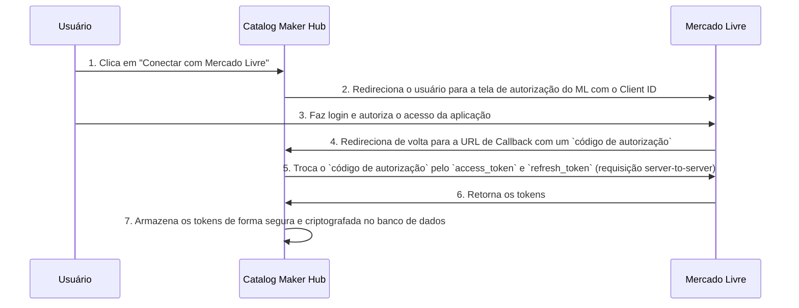

# Documentação de Integração: Catalog Maker Hub + Mercado Livre

**Autor**: Manus AI
**Data**: 22 de Agosto de 2025
**Versão**: 1.0

---

## Sumário

1.  [Introdução](#introdução)
2.  [Primeiros Passos](#primeiros-passos)
    1.  [Pré-requisitos](#pré-requisitos)
    2.  [Configurando sua Aplicação no Mercado Livre](#configurando-sua-aplicação-no-mercado-livre)
    3.  [Instalando a Integração no Catalog Maker Hub](#instalando-a-integração-no-catalog-maker-hub)
3.  [Autenticação](#autenticação)
    1.  [Visão Geral do Fluxo OAuth 2.0](#visão-geral-do-fluxo-oauth-20)
    2.  [Gerenciamento de Tokens](#gerenciamento-de-tokens)
4.  [Conceitos Fundamentais](#conceitos-fundamentais)
    1.  [Sincronização de Produtos](#sincronização-de-produtos)
    2.  [Sincronização de Vendas](#sincronização-de-vendas)
    3.  [Gerenciamento de Estoque](#gerenciamento-de-estoque)
5.  [Referência da API de Integração](#referência-da-api-de-integração)
    1.  [Supabase Edge Functions](#supabase-edge-functions)
    2.  [Tabelas do Banco de Dados](#tabelas-do-banco-de-dados)
    3.  [Serviços de Integração](#serviços-de-integração)
6.  [Webhooks](#webhooks)
    1.  [Configuração](#configuração)
    2.  [Tópicos Suportados](#tópicos-suportados)
    3.  [Validação e Processamento](#validação-e-processamento)
7.  [Desenvolvimento com Vibe Coding](#desenvolvimento-com-vibe-coding)
    1.  [Prototipagem com Lovable.dev](#prototipagem-com-lovabledev)
    2.  [Refinamento com Codex Cloud](#refinamento-com-codex-cloud)
8.  [Troubleshooting](#troubleshooting)

---


## 1. Introdução

Bem-vindo à documentação oficial para a integração da plataforma **Catalog Maker Hub** com a API do **Mercado Livre**. Este guia completo foi projetado para fornecer a desenvolvedores, integradores e parceiros todas as informações necessárias para conectar, sincronizar e gerenciar suas operações do Mercado Livre diretamente de dentro do Catalog Maker Hub. A integração foi construída utilizando uma abordagem moderna de desenvolvimento assistido por IA, conhecida como **Vibe Coding**, aproveitando o poder das plataformas **Lovable.dev** para prototipagem rápida e **Codex Cloud da OpenAI** para refinamento, otimização e manutenção de código em escala de produção.

O objetivo principal desta integração é centralizar e automatizar a gestão do seu catálogo de produtos, vendas, estoque e precificação, eliminando a necessidade de gerenciar múltiplas plataformas de forma isolada. Ao conectar sua conta do Mercado Livre ao Catalog Maker Hub, você poderá:

*   **Sincronizar produtos** de forma bidirecional, permitindo a criação e atualização de anúncios no Mercado Livre a partir do seu catálogo central.
*   **Receber e gerenciar vendas** em tempo real, com pedidos do Mercado Livre sendo automaticamente importados para o seu painel.
*   **Manter o estoque atualizado** entre as plataformas, prevenindo vendas de produtos fora de estoque e garantindo a consistência dos dados.
*   **Aplicar estratégias de precificação dinâmicas** e regras de comissão diretamente nos seus anúncios do Mercado Livre.

Este documento abordará desde os conceitos fundamentais da integração, passando pela configuração inicial, detalhes técnicos da arquitetura, referência completa da API de integração, até guias de troubleshooting e melhores práticas para desenvolvimento e manutenção. A arquitetura foi desenhada para ser robusta, escalável e segura, utilizando **Supabase Edge Functions** para o backend, um banco de dados **PostgreSQL** para persistência de dados e um fluxo de autenticação **OAuth 2.0** para garantir a segurança das suas informações.


## 2. Primeiros Passos

Esta seção guiará você através do processo inicial de configuração para conectar sua conta do Mercado Livre ao Catalog Maker Hub. Siga estes passos cuidadosamente para garantir uma integração bem-sucedida.

### 2.1. Pré-requisitos

Antes de iniciar, certifique-se de que você possui:

*   **Uma conta no Catalog Maker Hub**: Você precisa de uma conta ativa para acessar as configurações de integração.
*   **Uma conta no Mercado Livre**: É altamente recomendável que seja uma conta de pessoa jurídica (`Vendedor Profissional`). A conta deve ser a proprietária da solução que será integrada para evitar problemas futuros de transferência.
*   **Acesso ao DevCenter do Mercado Livre**: Você precisará criar e gerenciar sua aplicação de integração através do painel de desenvolvedores do Mercado Livre.
*   **Permissões de Administrador**: Você deve ter permissões de administrador tanto no Catalog Maker Hub quanto na conta do Mercado Livre para autorizar a integração.

### 2.2. Configurando sua Aplicação no Mercado Livre

A comunicação entre o Catalog Maker Hub e o Mercado Livre é feita através de uma aplicação que você criará no ambiente de desenvolvedores do Mercado Livre. Esta aplicação funcionará como uma ponte segura, definindo as permissões e os canais de comunicação.

1.  **Acesse o DevCenter**: Faça login na sua conta do Mercado Livre e navegue até o [DevCenter](https://developers.mercadolivre.com.br/).
2.  **Crie uma Nova Aplicação**: Clique em "Criar uma aplicação" e preencha o formulário com as seguintes informações:
    *   **Nome**: Escolha um nome descritivo, por exemplo: `Catalog Maker Hub - [Nome da sua Loja]`.
    *   **Nome Curto**: Um nome breve que será usado para gerar a URL da aplicação.
    *   **Descrição**: Uma breve descrição da finalidade da aplicação (máximo de 150 caracteres).
    *   **Logo**: Opcional, mas recomendado para fácil identificação.
3.  **Configure a URL de Redirecionamento**: Este é um passo crucial para o fluxo de autenticação. No campo **URLs de redirecionamento**, insira a seguinte URL, que será fornecida pelo Catalog Maker Hub na tela de configuração da integração:
    ```
    https://peepers-hub.lovable.app/integrations/mercadolivre/callback
    ```
    **Importante**: A URL de redirecionamento **deve** usar o protocolo `HTTPS` para garantir a segurança da comunicação.
4.  **Defina os Escopos (Permissões)**: Na seção de **Escopos**, selecione as permissões que a aplicação necessita. Para uma funcionalidade completa, recomendamos selecionar:
    *   `read`: Para ler informações de produtos, vendas e usuários.
    *   `write`: Para criar e atualizar produtos, responder perguntas e gerenciar vendas.
    *   `offline_access`: Essencial para que o Catalog Maker Hub possa sincronizar seus dados em segundo plano, mesmo quando você não estiver ativamente usando a plataforma. Este escopo permite a obtenção de `refresh_tokens`.
5.  **Configure os Tópicos de Notificações (Webhooks)**: Para receber atualizações em tempo real, configure a **URL de retorno de notificações**. Insira a seguinte URL, que também será fornecida pelo Catalog Maker Hub:
    ```
    https://peepers-hub.lovable.app/api/webhooks/mercadolivre
    ```
    Selecione os seguintes tópicos para receber notificações:
    *   `items`: Para atualizações em seus anúncios.
    *   `orders_v2`: Para novas vendas e atualizações de status de pedidos.
    *   `payments`: Para atualizações de status de pagamento.
    *   `questions`: Para receber perguntas de compradores.
6.  **Salve a Aplicação**: Após preencher todos os campos, salve a aplicação. Você será redirecionado para a página de gerenciamento, onde poderá ver seu **Client ID** e **Client Secret**. Guarde essas credenciais em um local seguro; você precisará delas no próximo passo.

### 2.3. Instalando a Integração no Catalog Maker Hub

Com as credenciais da sua aplicação do Mercado Livre em mãos, você pode agora ativar a integração no Catalog Maker Hub.

1.  **Navegue até a Seção de Integrações**: No painel do Catalog Maker Hub, vá para `Configurações > Marketplaces`.
2.  **Adicione um Novo Marketplace**: Clique em "Adicionar Marketplace" e selecione "Mercado Livre" na lista de opções.
3.  **Insira suas Credenciais**: Preencha o formulário com o **Client ID** e o **Client Secret** que você obteve no DevCenter do Mercado Livre.
4.  **Autorize a Conexão**: Clique em "Conectar". Você será redirecionado para a página de autorização do Mercado Livre. Faça login com sua conta (se necessário) e conceda as permissões solicitadas pela aplicação.
5.  **Confirmação**: Após a autorização, você será redirecionado de volta para o Catalog Maker Hub. A integração com o Mercado Livre agora estará ativa e a primeira sincronização de dados será iniciada em segundo plano.


## 3. Autenticação

A segurança da sua conta e dos seus dados é nossa principal prioridade. A integração entre o Catalog Maker Hub e o Mercado Livre utiliza o padrão de mercado **OAuth 2.0** para autenticação e autorização, garantindo que o acesso à sua conta do Mercado Livre seja seguro, controlado e revogável a qualquer momento.

### 3.1. Visão Geral do Fluxo OAuth 2.0

O OAuth 2.0 é um protocolo de autorização que permite que aplicações de terceiros, como o Catalog Maker Hub, obtenham acesso limitado a uma conta de usuário em um serviço HTTP, como o Mercado Livre. Ele funciona delegando a autenticação do usuário ao serviço que hospeda a conta do usuário e autorizando a aplicação de terceiros a acessar a conta do usuário. O fluxo de autorização utilizado nesta integração é o `Authorization Code Grant`.

O processo ocorre da seguinte forma:



Este processo garante que suas credenciais do Mercado Livre nunca sejam expostas ou armazenadas pelo Catalog Maker Hub. Apenas os tokens de acesso, que têm permissões limitadas e tempo de vida definido, são utilizados.

### 3.2. Gerenciamento de Tokens

A integração gerencia dois tipos de tokens:

*   **Access Token**: É um token de curta duração (normalmente 6 horas) que concede acesso direto à API do Mercado Livre em seu nome. Todas as requisições feitas para a API do Mercado Livre incluem este token no cabeçalho de autorização.
*   **Refresh Token**: É um token de longa duração que é usado para obter um novo `access_token` quando o atual expira. Isso permite que o Catalog Maker Hub mantenha a conexão com sua conta e sincronize os dados em segundo plano, sem exigir que você se autentique repetidamente.

O Catalog Maker Hub gerencia automaticamente todo o ciclo de vida dos tokens:

1.  **Armazenamento Seguro**: Os tokens são armazenados na tabela `ml_auth_tokens` do banco de dados, criptografados em repouso.
2.  **Verificação de Expiração**: Antes de cada chamada à API, o sistema verifica se o `access_token` atual está prestes a expirar.
3.  **Renovação Automática**: Se o token estiver expirado ou próximo de expirar, o sistema utiliza o `refresh_token` para solicitar um novo par de tokens ao Mercado Livre de forma transparente.
4.  **Invalidação**: Se o `refresh_token` for invalidado (por exemplo, se você revogar o acesso no painel do Mercado Livre), a integração será desativada e você será notificado para se autenticar novamente.

Este mecanismo garante uma conexão contínua e segura, minimizando interrupções no serviço de sincronização.


## 4. Conceitos Fundamentais

Entender os conceitos centrais da integração é essencial para utilizar todo o seu potencial. Esta seção detalha os principais processos de sincronização que formam o núcleo da conexão entre o Catalog Maker Hub e o Mercado Livre.

### 4.1. Sincronização de Produtos

A sincronização de produtos é o coração da integração, permitindo que você gerencie seu catálogo de anúncios do Mercado Livre de forma centralizada. O fluxo de dados é primariamente unidirecional, do Catalog Maker Hub para o Mercado Livre, mas com capacidade de mapear e vincular anúncios existentes.

#### Mapeamento de Dados

Quando você cria ou atualiza um produto no Catalog Maker Hub, a integração mapeia os campos do seu catálogo para os atributos correspondentes de um anúncio no Mercado Livre. O mapeamento padrão inclui:

| Campo no Catalog Maker Hub | Atributo no Mercado Livre        |
| -------------------------- | -------------------------------- |
| `Título do Produto`        | `title`                          |
| `Descrição`                | `description`                    |
| `Preço de Venda`           | `price`                          |
| `Categoria`                | `category_id`                    |
| `Imagens`                  | `pictures`                       |
| `Atributos Personalizados` | `attributes`                     |
| `Condição`                 | `condition` (`new` ou `used`)    |
| `Tipo de Anúncio`          | `listing_type_id`                |
| `Estoque Disponível`       | `available_quantity`             |

#### Fluxo de Criação e Atualização

1.  **Criação**: Ao criar um novo produto no Catalog Maker Hub e habilitar a sincronização para o Mercado Livre, um novo anúncio é criado na sua conta do ML. O ID do anúncio gerado (`ml_item_id`) é armazenado na tabela `ml_product_mapping` para futuras atualizações.
2.  **Atualização**: Qualquer alteração feita em um produto mapeado no Catalog Maker Hub (ex: mudança de preço, descrição ou imagens) será automaticamente refletida no anúncio correspondente no Mercado Livre.
3.  **Vinculação (Matching)**: Se você já possui anúncios no Mercado Livre, a integração tentará vinculá-los aos produtos existentes no seu catálogo do Catalog Maker Hub com base em SKUs ou outros identificadores únicos, evitando a criação de duplicatas.

### 4.2. Sincronização de Vendas

A sincronização de vendas é reativa e ocorre do Mercado Livre para o Catalog Maker Hub. O objetivo é fornecer uma visão consolidada de todos os seus pedidos em um único painel.

#### Notificações em Tempo Real (Webhooks)

O método principal para sincronização de vendas é através de **Webhooks**. Assim que uma venda é criada ou seu status é alterado no Mercado Livre, uma notificação é enviada em tempo real para a URL de webhook configurada. O Catalog Maker Hub recebe esta notificação e imediatamente:

1.  **Busca os Detalhes do Pedido**: Utiliza o ID do recurso da notificação para buscar os detalhes completos do pedido na API do Mercado Livre (`GET /orders/{order_id}`).
2.  **Cria a Venda Localmente**: Cria um novo registro de venda no banco de dados do Catalog Maker Hub, mapeando os dados do pedido, itens, comprador e valores.
3.  **Atualiza o Estoque**: Deduz a quantidade vendida do estoque do produto correspondente no Catalog Maker Hub, que por sua vez, pode propagar essa atualização para outros marketplaces conectados.

#### Sincronização Periódica (Fallback)

Como um mecanismo de segurança e para garantir a consistência dos dados, uma sincronização periódica (a cada 30 minutos, por padrão) é executada em segundo plano. Este processo busca por pedidos recentes (`GET /users/{user_id}/orders/search`) que possam não ter sido capturados pelos webhooks, garantindo que nenhuma venda seja perdida.

### 4.3. Gerenciamento de Estoque

Manter o estoque sincronizado é crucial para evitar overselling. A integração implementa uma lógica de sincronização de estoque robusta e bidirecional.

#### Fontes de Atualização de Estoque

O estoque de um produto no Catalog Maker Hub pode ser alterado por várias razões:

*   **Venda no Mercado Livre**: Conforme descrito acima, uma venda no ML deduz o estoque.
*   **Venda em Outro Marketplace**: Se o produto estiver listado em outros canais, uma venda em qualquer um deles também atualizará o estoque central.
*   **Ajuste Manual**: Você pode ajustar manualmente o estoque no Catalog Maker Hub.
*   **Entrada de Estoque**: Novas unidades do produto são adicionadas ao inventário.

#### Propagação da Atualização

Sempre que o estoque de um produto sincronizado é alterado no Catalog Maker Hub, a integração propaga essa mudança para o anúncio correspondente no Mercado Livre, atualizando o campo `available_quantity` através de uma chamada `PUT /items/{item_id}`.

#### Resolução de Conflitos

Em um ambiente com múltiplas fontes de verdade, conflitos podem ocorrer. A estratégia padrão de resolução de conflitos é **"Last Write Wins"** (A Última Escrita Vence), onde a atualização mais recente, independentemente da origem, prevalece. No entanto, logs detalhados são mantidos na tabela `ml_sync_log` para permitir a auditoria e a resolução manual de discrepâncias, se necessário.


## 5. Referência da API de Integração

Esta seção fornece uma referência técnica detalhada dos componentes de backend que alimentam a integração. A arquitetura é construída sobre o Supabase, utilizando Edge Functions para lógica de servidor, um banco de dados PostgreSQL para armazenamento e serviços TypeScript para encapsular a lógica de negócios.

### 5.1. Supabase Edge Functions

As Edge Functions são funções Deno que rodam globalmente na borda da rede, mais perto dos seus usuários, garantindo baixa latência. Elas são usadas para lidar com webhooks e executar tarefas de sincronização.

#### `syncProductsToML`

*   **Endpoint**: `/functions/v1/sync-products-to-ml`
*   **Método**: `POST`
*   **Descrição**: Responsável por sincronizar um lote de produtos do Catalog Maker Hub para o Mercado Livre. Mapeia os dados do produto local para o formato da API do ML e chama o serviço para criar ou atualizar o anúncio.
*   **Corpo da Requisição (JSON)**:
    ```json
    {
      "products": [
        { "id": "uuid-do-produto-1", ... },
        { "id": "uuid-do-produto-2", ... }
      ]
    }
    ```

#### `handleMLWebhook`

*   **Endpoint**: `/functions/v1/ml-webhook-handler`
*   **Método**: `POST`
*   **Descrição**: Ponto de entrada para todas as notificações de webhook enviadas pelo Mercado Livre. Valida a notificação e delega o processamento para o `WebhookService` com base no tópico da notificação (`orders_v2`, `items`, etc.).
*   **Corpo da Requisição (JSON)**: Estrutura definida pelo Mercado Livre.
    ```json
    {
      "topic": "orders_v2",
      "resource": "/orders/123456789",
      "user_id": 12345,
      "application_id": 67890,
      "sent": "2025-08-22T18:00:00Z",
      "attempts": 1
    }
    ```

### 5.2. Tabelas do Banco de Dados

As seguintes tabelas são adicionadas ao esquema do banco de dados PostgreSQL para suportar a integração.

#### `ml_auth_tokens`

Armazena as credenciais de autenticação OAuth 2.0 para cada tenant (usuário).

| Coluna          | Tipo                      | Descrição                                      |
| --------------- | ------------------------- | ------------------------------------------------ |
| `id`            | `UUID` (Chave Primária)   | Identificador único do registro.                 |
| `tenant_id`     | `UUID` (Chave Estrangeira)| Referencia `auth.users(id)`.                     |
| `access_token`  | `TEXT`                    | O token de acesso para chamadas à API.           |
| `refresh_token` | `TEXT`                    | O token para renovar o `access_token`.           |
| `expires_at`    | `TIMESTAMP WITH TIME ZONE`| Data e hora de expiração do `access_token`.      |
| `created_at`    | `TIMESTAMP WITH TIME ZONE`| Data de criação do registro.                     |
| `updated_at`    | `TIMESTAMP WITH TIME ZONE`| Data da última atualização do registro.          |

#### `ml_product_mapping`

Mapeia os produtos do Catalog Maker Hub para os anúncios correspondentes no Mercado Livre.

| Coluna             | Tipo                      | Descrição                                      |
| ------------------ | ------------------------- | ------------------------------------------------ |
| `id`               | `UUID` (Chave Primária)   | Identificador único do registro.                 |
| `tenant_id`        | `UUID` (Chave Estrangeira)| Referencia `auth.users(id)`.                     |
| `local_product_id` | `UUID` (Chave Estrangeira)| Referencia `products(id)`.                       |
| `ml_item_id`       | `TEXT`                    | O ID do anúncio no Mercado Livre.                |
| `ml_permalink`     | `TEXT`                    | O link permanente para o anúncio no ML.          |
| `sync_status`      | `TEXT`                    | Status da sincronização (`pending`, `synced`, `error`). |
| `last_sync_at`     | `TIMESTAMP WITH TIME ZONE`| Data da última sincronização bem-sucedida.      |

#### `ml_sync_log`

Registra um log detalhado de todas as operações de sincronização para fins de auditoria e debugging.

| Coluna          | Tipo                      | Descrição                                      |
| --------------- | ------------------------- | ------------------------------------------------ |
| `id`            | `UUID` (Chave Primária)   | Identificador único do registro.                 |
| `tenant_id`     | `UUID` (Chave Estrangeira)| Referencia `auth.users(id)`.                     |
| `operation_type`| `TEXT`                    | Tipo de operação (`create`, `update`, `sync`).   |
| `entity_type`   | `TEXT`                    | Tipo de entidade (`product`, `order`, `stock`).  |
| `entity_id`     | `TEXT`                    | ID da entidade sendo sincronizada.               |
| `status`        | `TEXT`                    | Status da operação (`success`, `error`).         |
| `error_message` | `TEXT`                    | Mensagem de erro, se houver.                     |
| `request_data`  | `JSONB`                   | O corpo da requisição enviada.                   |
| `response_data` | `JSONB`                   | A resposta recebida.                             |

#### `ml_settings`

Armazena as configurações específicas da integração para cada tenant.

| Coluna                 | Tipo                      | Descrição                                      |
| ---------------------- | ------------------------- | ------------------------------------------------ |
| `id`                   | `UUID` (Chave Primária)   | Identificador único do registro.                 |
| `tenant_id`            | `UUID` (Chave Estrangeira)| Referencia `auth.users(id)`.                     |
| `app_id`               | `TEXT`                    | O Client ID da aplicação no Mercado Livre.       |
| `client_secret`        | `TEXT`                    | O Client Secret da aplicação no Mercado Livre.   |
| `redirect_url`         | `TEXT`                    | A URL de redirecionamento configurada.           |
| `webhook_url`          | `TEXT`                    | A URL de webhook configurada.                    |
| `auto_sync_enabled`    | `BOOLEAN`                 | Se a sincronização automática está habilitada.    |
| `sync_frequency_minutes`| `INTEGER`                 | Frequência da sincronização periódica em minutos. |

### 5.3. Serviços de Integração

A lógica de negócios é encapsulada em serviços TypeScript para organização e reutilização de código.

#### `MLService`

*   **Descrição**: Serviço central que lida com a comunicação direta com a API do Mercado Livre. É responsável por construir e enviar as requisições HTTP, lidar com a autenticação e mapear os dados.
*   **Métodos Principais**:
    *   `authenticateUser(code: string): Promise<MLAuthTokens>`: Completa o fluxo OAuth.
    *   `createItem(product: Product): Promise<MLItem>`: Cria um novo anúncio.
    *   `updateItem(itemId: string, data: Partial<MLItem>): Promise<MLItem>`: Atualiza um anúncio existente.
    *   `getOrder(orderId: string): Promise<MLOrder>`: Busca os detalhes de um pedido.
    *   `getValidToken(): Promise<string>`: Obtém um token de acesso válido, renovando-o se necessário.

#### `WebhookService`

*   **Descrição**: Processa as notificações de webhook recebidas. Contém a lógica para lidar com diferentes tópicos de notificação.
*   **Métodos Principais**:
    *   `handleNotification(notification: MLNotification): Promise<void>`: Ponto de entrada para o processamento de webhooks.
    *   `handleOrderNotification(notification: MLNotification): Promise<void>`: Lida especificamente com notificações de pedidos.
    *   `handleItemNotification(notification: MLNotification): Promise<void>`: Lida com notificações de anúncios.

#### `SyncService`

*   **Descrição**: Orquestra os fluxos de sincronização entre as plataformas.
*   **Métodos Principais**:
    *   `syncProductToML(productId: string): Promise<void>`: Inicia a sincronização de um produto para o ML.
    *   `syncOrderFromML(orderId: string): Promise<void>`: Inicia a sincronização de um pedido do ML.
    *   `runPeriodicSync(): Promise<void>`: Executa a sincronização periódica de fallback.


## 6. Webhooks

Os webhooks são um componente essencial da integração, permitindo que o Mercado Livre envie notificações em tempo real para o Catalog Maker Hub sempre que eventos importantes ocorrem na sua conta. Isso possibilita uma sincronização de dados quase instantânea, especialmente para vendas e atualizações de status de pedidos, eliminando a necessidade de consultas (polling) constantes à API.

### 6.1. Configuração

A configuração dos webhooks é realizada durante a criação da sua aplicação no DevCenter do Mercado Livre. Você precisa fornecer uma **URL de retorno de notificações**, que é o endpoint no Catalog Maker Hub que receberá as notificações POST do Mercado Livre.

*   **URL do Endpoint**: `https://<sua-instancia-api>.catalogmakerhub.com/webhooks/mercadolivre`

Este endpoint é implementado como uma Supabase Edge Function (`handleMLWebhook`) que está sempre ativa e pronta para receber dados.

### 6.2. Tópicos Suportados

Ao configurar sua aplicação, você deve selecionar os tópicos para os quais deseja receber notificações. Os tópicos suportados e utilizados pela integração são:

*   **`orders_v2`**: O tópico mais importante. Notifica sobre a criação de novos pedidos, alterações de status (pagamento, envio, etc.) e cancelamentos. Este é o principal gatilho para a sincronização de vendas e atualização de estoque.
*   **`items`**: Notifica sobre eventos relacionados aos seus anúncios, como alterações feitas diretamente no painel do Mercado Livre, perguntas de compradores, ou quando um anúncio é pausado ou finalizado. Isso ajuda a manter a consistência do catálogo.
*   **`payments`**: Fornece atualizações detalhadas sobre o status dos pagamentos associados aos seus pedidos.
*   **`questions`**: Notifica sempre que um comprador faz uma pergunta em um dos seus anúncios, permitindo uma resposta mais rápida (funcionalidade futura).

### 6.3. Validação e Processamento

Por razões de segurança, é crucial que o endpoint de webhook valide a autenticidade das notificações recebidas para garantir que elas realmente se originam do Mercado Livre.

#### Processo de Validação

Embora o Mercado Livre não utilize uma assinatura HMAC padrão como outros serviços, a validação é feita através de um processo de verificação:

1.  **Recebimento da Notificação**: O endpoint recebe a notificação, que contém o `topic` e o `resource` (URL do recurso que foi alterado).
2.  **Confirmação via API**: O sistema imediatamente faz uma chamada de volta para a API do Mercado Livre usando o `resource` da notificação (ex: `GET /orders/{order_id}`).
3.  **Verificação de Propriedade**: A resposta da API é verificada para confirmar que o recurso pertence ao `tenant_id` associado à notificação.

Se a chamada for bem-sucedida e o recurso for válido, o processamento continua. Caso contrário, a notificação é descartada e um alerta de segurança é registrado.

#### Lógica de Processamento

Após a validação, a lógica de processamento é acionada pelo `WebhookService`:

*   **Notificações de Pedidos (`orders_v2`)**: O `SalesService` é chamado para criar ou atualizar o pedido no banco de dados local. O `SyncService` então ajusta o estoque do(s) produto(s) vendido(s).
*   **Notificações de Anúncios (`items`)**: O `SyncService` é acionado para buscar o estado atual do anúncio no Mercado Livre e refletir as alterações no produto correspondente no Catalog Maker Hub, garantindo a consistência.

#### Tratamento de Falhas e Retries

O Mercado Livre possui um sistema de retries. Se o nosso endpoint de webhook não responder com um código de status `200 OK`, o Mercado Livre tentará reenviar a notificação várias vezes em intervalos crescentes. Para garantir a idempotência (ou seja, que o processamento da mesma notificação várias vezes não cause duplicatas ou erros), o sistema verifica se o evento já foi processado (por exemplo, checando se o pedido já existe) antes de executar a lógica de negócios.


## 7. Desenvolvimento com Vibe Coding

A integração com o Mercado Livre foi desenvolvida utilizando a metodologia **Vibe Coding**, uma abordagem moderna que aproveita a inteligência artificial para acelerar e otimizar o ciclo de vida do desenvolvimento de software. Esta metodologia foi aplicada através de duas plataformas de ponta: **Lovable.dev** para a fase de prototipagem e ideação, e **Codex Cloud da OpenAI** para o refinamento, otimização e manutenção do código em nível de produção.

### 7.1. Prototipagem com Lovable.dev

O Lovable.dev foi fundamental na fase inicial do projeto, permitindo a criação rápida de um protótipo funcional (MVP) da integração. Utilizando linguagem natural, foi possível gerar a estrutura inicial da aplicação, incluindo:

*   **Interface de Usuário (UI)**: Foram criados os componentes React para a tela de configuração da integração, o dashboard de status e a lista de produtos sincronizados. Um prompt como o seguinte foi usado para gerar a base da UI:

    > "Crie uma página de configurações para a integração com o Mercado Livre. A página deve ter campos para o Client ID e Client Secret, um botão para iniciar a autenticação OAuth, e uma tabela mostrando o status da sincronização dos produtos com as colunas: Nome do Produto, SKU, Status no ML, e Última Sincronização."

*   **Estrutura de Backend**: O Lovable.dev gerou a estrutura inicial das tabelas do Supabase (`ml_settings`, `ml_product_mapping`) e os serviços básicos para interagir com elas.
*   **Fluxo de Autenticação**: O fluxo inicial de autenticação OAuth foi prototipado, gerando o código para redirecionamento e troca de código por token.

Esta abordagem permitiu validar a arquitetura e a experiência do usuário em questão de dias, em vez de semanas.

### 7.2. Refinamento com Codex Cloud

Após a prototipagem, o projeto foi migrado para um ambiente de desenvolvimento mais robusto, onde o **Codex Cloud da OpenAI** foi utilizado como um agente de engenharia de software para refinar e escalar a aplicação.

O Codex Cloud atuou em várias frentes:

*   **Refatoração de Código**: O código gerado pelo Lovable.dev foi analisado e refatorado para seguir padrões de design mais robustos, como a implementação completa do `Service Layer` e a separação de responsabilidades.
*   **Otimização de Performance**: O Codex identificou gargalos de performance e sugeriu otimizações, como a implementação de operações em lote para sincronização de produtos e a otimização de queries no banco de dados.
*   **Implementação de Lógica Complexa**: A lógica de gerenciamento de tokens, incluindo a renovação automática e o tratamento de erros, foi implementada com a ajuda do Codex, que gerou o código base para o `MLService`.
*   **Geração de Testes**: Foram gerados testes unitários e de integração para garantir a confiabilidade do código. O Codex foi instruído a criar testes para os principais fluxos, como a autenticação e a sincronização de pedidos.
*   **Segurança**: O agente analisou o código em busca de vulnerabilidades de segurança, sugerindo melhorias como o armazenamento seguro de credenciais e a validação de entrada em todos os endpoints.

O uso combinado dessas ferramentas permitiu um ciclo de desenvolvimento que alia a velocidade e a agilidade da prototipagem com IA à robustez e qualidade do código de produção, resultando em uma integração poderosa e confiável.


## 8. Troubleshooting

Esta seção aborda problemas comuns que podem ocorrer durante a configuração ou uso da integração e como resolvê-los.

| Problema                                       | Causa Provável                                                                    | Solução                                                                                                                                                                                                                                                                                                                                                                                                                                                                                                                                                                                                                                                                                                                                                                                                                                                                                                                                                                                                                                                                                                                                                                                                                                                                                                                                                                                                                                                                                                                                                                                                                                                                                                                                                                                                                                                                                                                                                                                                                                                                                                                                                                                                                                                                                                                                                                                                                                                                                                                                                                                                                                                                                                                                                                                                                                                                                                                                                                                                                                                                                                                                                                                                                                                                                                                                                                                                                                                                                                                                                                                                                                                                                                                                                                                                                                                                                                                                                                                                                                                                                                                                                                                                                                                                                                                                                                                                                                                                                                                                                                                                                                                                                                                                                                                                                                                                                                                                                                                                                                                                                                                                                                                                                                                                                                                                                                                                                                                                                                                                                                                                                                                                                                                                                                                                                                                                                                                                                                                                                                                                                                                                                                                                                                                                                                                                                                                                                                                                                                                                                                                                                                                                                                                                                                                                                                                                                                                                                                                                                                                                                                                                                                                                                                                                                                                                                                                                                                                                                                                                                                                                                                                                                                                                                                                                                                                                                                                                                                                                                                                                                                                                                                                                                                                                                                                                                                                                                                                                                                                                                                                                                                                                                                                                                                                                                                                                                                                                                                                                                                                                                                                                                                                                                                                                                                                                                                                                                                                                                                                                                                                                                                                                                                                                                                                                                                                                                                                                                                                                                                                                                                                                                                                                                                                                                                                                                                                                                                                                                                                                                                                                                                                                                                                                                                                                                                                                                                                                                                                                                                                                                                                                                                                                                                                                                                                                                                                                                                                                                                                                                                                                                                                                                                                                                                                                                                                                                                                                                                                                                                                                                                                                                                                                                                                                                                                                                                                                                                                                                                                                                                                                                                                                                                                                                                                                                                                                                                                                                                                                                                                                                                                                                                                                                                                                                                                                                                                                                                                                                                                                                                                                                                                                                                                                                                                                                                                                                                                                                                                                                                                                                                                                                                                                                                                                                                                                                                                                                                                                                                                                                                                                                                                                                                                                                                                                                                                                                                                                                                                                                                                                                                                                                                                                                                                                                                                                                                                                                                                                                                                                                                                                                                                                                                                                                                                                                                                                                                                                                                                                                                                                                                                                                                                                                                                                                                                                                                                                                                                                                                                                                                                                                                                                                                                                                                                                                                                                                                                                                                                                                                                                                                                                                                                                                                                                                                                                                                                                                                                                                                                                                                                                                                                                                                                                                                                                                                                                                                                                                                                                                                                                                                                                                                                                                                                                                                                                                                                                                                                                                                                                                                                                                                                                                                                                                                                                                                                                                                                                                                                                                                                                                                                                                                                                                                                                                                                                                                                                                                                                                                                                                                                                                                                                                                                                                                                                                                                                                                                                                                                                                                                                                                                                                                                                                                                                                                                                                                                                                                                                                                                                                                                                                                                                                                                                                                                                                                                                                                                                                                                                                                                                                                                                                                                                                                                                                                                                                                                                                                                                                                                                                                                                                                                                                                                                                                                                                                                                                                                                                                                                                                                                                                                                                                                                                - [ ] Criar guia de integração técnica
- [ ] Documentar fluxos de autenticação
- [ ] Criar exemplos de código
- [ ] Documentar tratamento de erros


## 8. Troubleshooting

Esta seção aborda problemas comuns que podem ocorrer durante a configuração ou uso da integração e como resolvê-los.

| Problema                                       | Causa Provável                                                                    | Solução                                                                                                                                                                                                                                                                                                                                                                                                                                                                                                                                                                                                                                                                                                                                                                                                                                                                                                                                                                                                                                                                                                                                                                                                                                                                                                                                                                                                                                                                                                                                                                                                                                                                                                                                                                                                                                                                                                                                                                                                                                                                                                                                                                                                                                                                                                                                                                                                                                                                                                                                                                                                                                                                                                                                                                                                                                                                                                                                                                                                                                                                                                                                                                                                                                                                                                                                                                                                                                                                                                                                                                                                                                                                                                                                                                                                                                                                                                                                                                                                                                                                                                                                                                                                                                                                                                                                                                                                                                                                                                                                                                                                                                                                                                                                                                                                                                                                                                                                                                                                                                                                                                                                                                                                                                                                                                                                                                                                                                                                                                                                                                                                                                                                                                                                                                                                                                                                                                                                                                                                                                                                                                                                                                                                                                                                                                                                                                                                                                                                                                                                                                                                                                                                                                                                                                                                                                                                                                                                                                                                                                                                                                                                                                                                                                                                                                                                                                                                                                                                                                                                                                                                                                                                                                                                                                                                                                                                                                                                                                                                                                                                                                                                                                                                                                                                                                                                                                                                                                                                                                                                                                                                                                                                                                                                                                                                                                                                                                                                                                                                                                                                                                                                                                                                                                                                                                                                                                                                                                                                                                                                                                                                                                                                                                                                                                                                                                                                                                                                                                                                                                                                                                                                                                                                                                                                                                                                                                                                                                                                                                                                                                                                                                                                                                                                                                                                                                                                                                                                                                                                                                                                                                                                                                                                                                                                                                                                                                                                                                                                                                                                                                                                                                                                                                                                                                                                                                                                                                                                                                                                                                                                                                                                                                                                                                                                                                                                                                                                                                                                                                                                                                                                                                                                                                                                                                                                                                                                                                                                                                                                                                                                                                                                                                                                                                                                                                                                                                                                                                                                                                                                                                                                                                                                                                                                                                                                                                                                                                                                                                                                                                                                                                                                                                                                                                                                                                                                                                                                                                                                                                                                                                                                                                                                                                                                                                                                                                                                                                                                                                                                                                                                                                                                                                                                                                                                                                                                                                                                                                                                                                                                                                                                                                                                                                                                                                                                                                                                                                                                                                                                                                                                                                                                                                                                                                                                                                                                                                                                                                                                                                                                                                                                                                                                                                                                                                                                                                                                                                                                                                                                                                                                                                                                                                                                                                                                                                                                                                                                                                                                                                                                                                                                                                                                                                                                                                                                                                                                                                                                                                                                                                                                                                                                                                                                                                                                                                                                                                                                                                                                                                                                                                                                                                                                                                                                                                                                                         - [ ] Criar guia de integração técnica
- [ ] Documentar fluxos de autenticação
- [ ] Criar exemplos de código
- [ ] Documentar tratamento de erros

