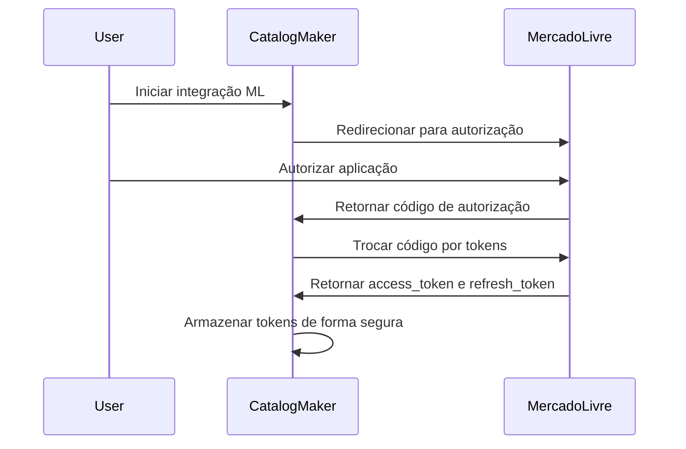
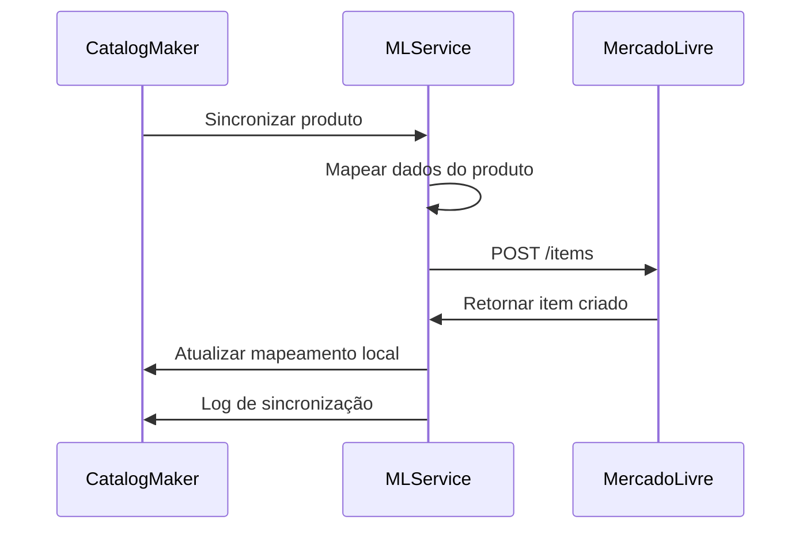
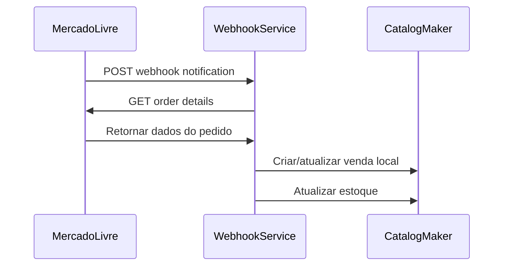

# Análise de Integração - Catalog Maker Hub + Mercado Livre API

## Resumo Executivo

Esta análise define a arquitetura e requisitos técnicos para integrar a plataforma Catalog Maker Hub com a API do Mercado Livre, utilizando metodologia Vibe Coding nas plataformas Lovable.dev e Codex cloud da OpenAI.

## Arquitetura de Integração

### Visão Geral da Arquitetura

```
┌─────────────────────────────────────────────────────────────────┐
│                    Catalog Maker Hub                           │
│  ┌─────────────────┐  ┌─────────────────┐  ┌─────────────────┐ │
│  │   Frontend      │  │    Backend      │  │   Database      │ │
│  │   React + TS    │  │   Supabase      │  │  PostgreSQL     │ │
│  └─────────────────┘  └─────────────────┘  └─────────────────┘ │
└─────────────────────────────────────────────────────────────────┘
                                │
                                │ API Integration Layer
                                ▼
┌─────────────────────────────────────────────────────────────────┐
│                 Mercado Livre Integration                      │
│  ┌─────────────────┐  ┌─────────────────┐  ┌─────────────────┐ │
│  │   Auth Service  │  │  API Gateway    │  │   Webhooks      │ │
│  │   OAuth 2.0     │  │   Rate Limit    │  │  Notifications  │ │
│  └─────────────────┘  └─────────────────┘  └─────────────────┘ │
└─────────────────────────────────────────────────────────────────┘
                                │
                                │ HTTPS/REST
                                ▼
┌─────────────────────────────────────────────────────────────────┐
│                    Mercado Livre API                           │
│  ┌─────────────────┐  ┌─────────────────┐  ┌─────────────────┐ │
│  │     Items       │  │     Orders      │  │   Payments      │ │
│  │   /items        │  │   /orders       │  │  /payments      │ │
│  └─────────────────┘  └─────────────────┘  └─────────────────┘ │
└─────────────────────────────────────────────────────────────────┘
```

### Componentes da Integração

#### 1. Camada de Autenticação
- **OAuth 2.0 Flow**: Implementação completa do fluxo de autorização
- **Token Management**: Gestão automática de access_token e refresh_token
- **Security Layer**: Armazenamento seguro de credenciais

#### 2. Camada de API Gateway
- **Rate Limiting**: Controle de taxa de requisições
- **Error Handling**: Tratamento robusto de erros
- **Retry Logic**: Lógica de retry para falhas temporárias
- **Logging**: Log detalhado de todas as operações

#### 3. Camada de Sincronização
- **Bidirectional Sync**: Sincronização bidirecional de dados
- **Conflict Resolution**: Resolução de conflitos de dados
- **Delta Sync**: Sincronização incremental
- **Batch Operations**: Operações em lote para eficiência

## Mapeamento de Funcionalidades

### Sincronização de Produtos

#### Fluxo: Catalog Maker Hub → Mercado Livre
```typescript
interface ProductSync {
  // Dados do Catalog Maker Hub
  localProduct: {
    id: string;
    title: string;
    description: string;
    price: number;
    category_id: string;
    images: string[];
    attributes: Record<string, any>;
  };
  
  // Mapeamento para Mercado Livre
  mlProduct: {
    title: string;
    category_id: string;
    price: number;
    currency_id: "BRL";
    available_quantity: number;
    buying_mode: "buy_it_now";
    condition: "new" | "used";
    listing_type_id: string;
    pictures: Array<{url: string}>;
    attributes: Array<{id: string, value_name: string}>;
  };
}
```

#### Endpoints Utilizados
- `POST /items`: Criação de novos anúncios
- `PUT /items/{item_id}`: Atualização de anúncios existentes
- `GET /categories/{category_id}/attributes`: Obtenção de atributos por categoria

### Sincronização de Vendas

#### Fluxo: Mercado Livre → Catalog Maker Hub
```typescript
interface SalesSync {
  // Dados do Mercado Livre
  mlOrder: {
    id: string;
    status: string;
    date_created: string;
    order_items: Array<{
      item: {id: string, title: string};
      quantity: number;
      unit_price: number;
    }>;
    buyer: {id: string, nickname: string};
    total_amount: number;
  };
  
  // Mapeamento para Catalog Maker Hub
  localSale: {
    external_id: string;
    marketplace: "mercado_livre";
    status: string;
    created_at: string;
    items: Array<{
      product_id: string;
      quantity: number;
      unit_price: number;
    }>;
    customer_info: Record<string, any>;
    total_amount: number;
  };
}
```

#### Endpoints Utilizados
- `GET /orders/{order_id}`: Detalhes do pedido
- `GET /users/{user_id}/orders/search`: Busca de pedidos
- Webhooks para notificações em tempo real

### Gestão de Estoque

#### Sincronização Bidirecional
```typescript
interface StockSync {
  // Atualização de estoque
  updateStock: {
    product_id: string;
    ml_item_id: string;
    available_quantity: number;
    sync_direction: "to_ml" | "from_ml" | "bidirectional";
  };
  
  // Controle de conflitos
  conflictResolution: {
    strategy: "last_write_wins" | "manual_review" | "ml_priority";
    timestamp: string;
    source: "catalog_maker" | "mercado_livre";
  };
}
```

## Requisitos Técnicos

### Infraestrutura

#### Supabase Edge Functions
```typescript
// Função para sincronização de produtos
export const syncProductsToML = async (req: Request) => {
  const { products } = await req.json();
  
  for (const product of products) {
    try {
      const mlProduct = mapProductToML(product);
      const response = await createMLItem(mlProduct);
      await updateLocalProduct(product.id, { ml_item_id: response.id });
    } catch (error) {
      await logError(error, product.id);
    }
  }
};

// Função para webhook do Mercado Livre
export const handleMLWebhook = async (req: Request) => {
  const notification = await req.json();
  
  switch (notification.topic) {
    case "orders_v2":
      await syncOrderFromML(notification.resource);
      break;
    case "items":
      await syncItemFromML(notification.resource);
      break;
  }
};
```

#### Banco de Dados - Novas Tabelas
```sql
-- Tabela para armazenar tokens do Mercado Livre
CREATE TABLE ml_auth_tokens (
  id UUID PRIMARY KEY DEFAULT gen_random_uuid(),
  tenant_id UUID REFERENCES auth.users(id),
  access_token TEXT NOT NULL,
  refresh_token TEXT NOT NULL,
  expires_at TIMESTAMP WITH TIME ZONE NOT NULL,
  created_at TIMESTAMP WITH TIME ZONE DEFAULT NOW(),
  updated_at TIMESTAMP WITH TIME ZONE DEFAULT NOW()
);

-- Tabela para mapeamento de produtos
CREATE TABLE ml_product_mapping (
  id UUID PRIMARY KEY DEFAULT gen_random_uuid(),
  tenant_id UUID REFERENCES auth.users(id),
  local_product_id UUID REFERENCES products(id),
  ml_item_id TEXT NOT NULL,
  ml_permalink TEXT,
  sync_status TEXT DEFAULT 'pending',
  last_sync_at TIMESTAMP WITH TIME ZONE,
  created_at TIMESTAMP WITH TIME ZONE DEFAULT NOW(),
  updated_at TIMESTAMP WITH TIME ZONE DEFAULT NOW()
);

-- Tabela para log de sincronização
CREATE TABLE ml_sync_log (
  id UUID PRIMARY KEY DEFAULT gen_random_uuid(),
  tenant_id UUID REFERENCES auth.users(id),
  operation_type TEXT NOT NULL, -- 'create', 'update', 'delete', 'sync'
  entity_type TEXT NOT NULL, -- 'product', 'order', 'stock'
  entity_id TEXT NOT NULL,
  status TEXT NOT NULL, -- 'success', 'error', 'pending'
  error_message TEXT,
  request_data JSONB,
  response_data JSONB,
  created_at TIMESTAMP WITH TIME ZONE DEFAULT NOW()
);

-- Tabela para configurações do Mercado Livre
CREATE TABLE ml_settings (
  id UUID PRIMARY KEY DEFAULT gen_random_uuid(),
  tenant_id UUID REFERENCES auth.users(id),
  app_id TEXT NOT NULL,
  client_secret TEXT NOT NULL,
  redirect_url TEXT NOT NULL,
  webhook_url TEXT,
  auto_sync_enabled BOOLEAN DEFAULT true,
  sync_frequency_minutes INTEGER DEFAULT 30,
  created_at TIMESTAMP WITH TIME ZONE DEFAULT NOW(),
  updated_at TIMESTAMP WITH TIME ZONE DEFAULT NOW()
);
```

### Serviços de Integração

#### MLService - Serviço Principal
```typescript
export class MLService extends BaseService {
  private baseURL = 'https://api.mercadolibre.com';
  
  async authenticateUser(code: string): Promise<MLAuthTokens> {
    const response = await fetch(`${this.baseURL}/oauth/token`, {
      method: 'POST',
      headers: { 'Content-Type': 'application/json' },
      body: JSON.stringify({
        grant_type: 'authorization_code',
        client_id: process.env.ML_CLIENT_ID,
        client_secret: process.env.ML_CLIENT_SECRET,
        code,
        redirect_uri: process.env.ML_REDIRECT_URI
      })
    });
    
    return response.json();
  }
  
  async createItem(product: Product): Promise<MLItem> {
    const token = await this.getValidToken();
    const mlProduct = this.mapProductToML(product);
    
    const response = await fetch(`${this.baseURL}/items`, {
      method: 'POST',
      headers: {
        'Authorization': `Bearer ${token}`,
        'Content-Type': 'application/json'
      },
      body: JSON.stringify(mlProduct)
    });
    
    return response.json();
  }
  
  async syncOrders(): Promise<void> {
    const token = await this.getValidToken();
    const userId = await this.getMLUserId(token);
    
    const response = await fetch(
      `${this.baseURL}/users/${userId}/orders/search?sort=date_desc`,
      {
        headers: { 'Authorization': `Bearer ${token}` }
      }
    );
    
    const orders = await response.json();
    
    for (const order of orders.results) {
      await this.processOrder(order);
    }
  }
}
```

#### WebhookService - Gestão de Webhooks
```typescript
export class WebhookService {
  async handleNotification(notification: MLNotification): Promise<void> {
    switch (notification.topic) {
      case 'orders_v2':
        await this.handleOrderNotification(notification);
        break;
      case 'items':
        await this.handleItemNotification(notification);
        break;
      case 'payments':
        await this.handlePaymentNotification(notification);
        break;
    }
  }
  
  private async handleOrderNotification(notification: MLNotification): Promise<void> {
    const orderId = notification.resource.split('/').pop();
    const order = await MLService.getOrder(orderId);
    
    // Sincronizar pedido com sistema local
    await SalesService.syncFromML(order);
    
    // Atualizar estoque se necessário
    if (order.status === 'paid') {
      await this.updateStockFromOrder(order);
    }
  }
}
```

## Fluxos de Integração

### Fluxo de Autenticação OAuth



### Fluxo de Sincronização de Produtos



### Fluxo de Webhook de Vendas



## Considerações para Vibe Coding

### Desenvolvimento com Lovable.dev

#### Prompts Recomendados
```
"Criar um serviço de integração com Mercado Livre que:
- Implemente autenticação OAuth 2.0
- Sincronize produtos bidirecionalmente
- Processe webhooks de vendas
- Gerencie tokens automaticamente
- Tenha tratamento robusto de erros"
```

#### Estrutura de Componentes
```typescript
// Componente para configuração da integração
const MLIntegrationSetup = () => {
  // Lovable.dev pode gerar automaticamente:
  // - Formulário de configuração
  // - Fluxo de autenticação OAuth
  // - Interface de status da integração
  // - Logs de sincronização
};

// Componente para gestão de produtos
const MLProductManager = () => {
  // Lovable.dev pode gerar automaticamente:
  // - Lista de produtos sincronizados
  // - Status de sincronização
  // - Botões de ação (sync, unsync)
  // - Resolução de conflitos
};
```

### Refinamento com Codex Cloud

#### Otimizações Automáticas
- **Performance**: Otimização de queries e operações em lote
- **Error Handling**: Implementação de retry logic e circuit breakers
- **Security**: Validação de entrada e sanitização de dados
- **Testing**: Geração automática de testes unitários e de integração

#### Code Review Automático
- **Best Practices**: Aplicação de padrões de código
- **Security Scan**: Identificação de vulnerabilidades
- **Performance Analysis**: Análise de gargalos
- **Documentation**: Geração automática de documentação

## Cronograma de Implementação

### Fase 1: Fundação (1-2 semanas)
- [ ] Configuração de autenticação OAuth
- [ ] Estrutura básica de serviços
- [ ] Tabelas de banco de dados
- [ ] Testes de conectividade

### Fase 2: Sincronização de Produtos (2-3 semanas)
- [ ] Mapeamento de dados
- [ ] Criação de anúncios
- [ ] Atualização de anúncios
- [ ] Gestão de imagens

### Fase 3: Sincronização de Vendas (2-3 semanas)
- [ ] Configuração de webhooks
- [ ] Processamento de pedidos
- [ ] Atualização de estoque
- [ ] Notificações

### Fase 4: Interface de Usuário (1-2 semanas)
- [ ] Dashboard de integração
- [ ] Configurações
- [ ] Logs e monitoramento
- [ ] Resolução de conflitos

### Fase 5: Testes e Deploy (1 semana)
- [ ] Testes de integração
- [ ] Testes de carga
- [ ] Deploy em produção
- [ ] Monitoramento

## Métricas de Sucesso

### Técnicas
- **Uptime**: > 99.5% de disponibilidade
- **Latência**: < 2s para operações de sincronização
- **Error Rate**: < 1% de falhas em operações
- **Sync Accuracy**: > 99% de precisão na sincronização

### Negócio
- **Time to Market**: Redução de 80% no tempo para publicar produtos
- **Sync Frequency**: Sincronização em tempo real via webhooks
- **User Adoption**: > 80% dos usuários utilizando a integração
- **Revenue Impact**: Aumento mensurável nas vendas via ML

